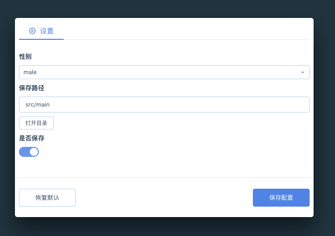

# electron-auto-setting

<center></center>

## How to Use?

```js
import create, { init, store } from 'electron-auto-setting'
const { app, Menu, Tray } = require('electron')
const { resolve } = require('path')

let setting = [
  {
    icon: 'icon-settings',
    label: '设置',
    configs: {
      gender: {
        type: 'choice',
        label: '性别',
        choices: ['male', 'female'],
        defaultValue: 'male'
      },
      path: {
        type: 'path',
        label: '保存路径',
        defaultValue: __dirname
      },
      output: {
        type: 'boolean',
        label: '是否保存',
        defaultValue: true
      }
    }
  }
]

let win = null
let tray = null

init(setting)

openSetting = () => {
  win = create()
  store.onDidChange('gender', console.log)
  console.log(store.store)
}

app.on('ready', () => {
  tray = new Tray(resolve(__dirname, 'icon.png'))
  const contextMenu = Menu.buildFromTemplate([
    { label: 'setting', click: openSetting }
  ])
  tray.setToolTip('This is my application.')
  tray.setContextMenu(contextMenu)
})

app.on('window-all-closed', () => {
  if (process.platform !== 'darwin') {
    app.quit()
  }
})
```

## icon

https://at-ui.github.io/at-ui/#/zh/docs/icon

## Type

* choice
* path
* boolean
